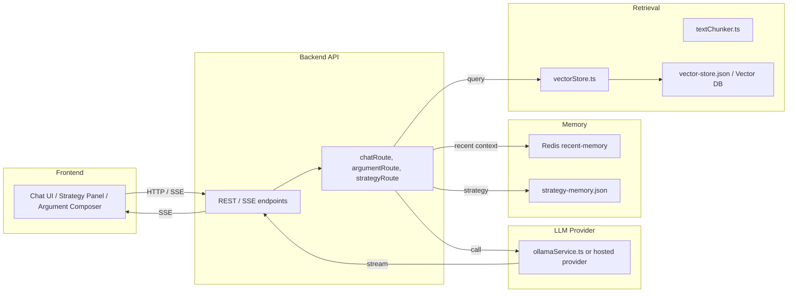

# AI MUN Assistant

Local-first RAG assistant for MUN research, strategy tracking, and argument generation.

## Overview

AI MUN Assistant is a local-first research copilot for Model United Nations workflows. It combines streaming chat, retrieval-augmented generation, Redis-backed short-term memory, and structured strategy memory so delegates can move from raw documents to debate-ready arguments faster.

## Why It Stands Out

- Local-first privacy: documents and chat context stay on your machine or infra.
- Streaming UX: responses arrive incrementally over SSE instead of waiting for a full completion.
- Retrieval quality: uploaded docs are chunked, embedded, ranked, and deduplicated before they reach the model.
- Strategy memory: debate position, allies, opponents, and notes persist across sessions.
- Argument generation: turns research into structured openings, counters, and cross-question prompts.

## System Architecture



## Core Features

- Streaming chat with SSE for low-latency partial responses.
- Local-first LLM provider abstraction with Ollama support and room for hosted APIs.
- RAG using chunked documents and a persistent vector index.
- Redis-backed short-term memory for recent chat context.
- File-backed strategy memory for persistent debate planning.
- Argument generation route for structured MUN outputs.

## Evaluation

Example benchmark targets for a recruiter-ready story:

| Metric | Value (example) | How measured |
|---|---:|---|
| Average response latency | 300–600 ms first token, 1–3s full answer | Local model run with a 5k token context |
| Retrieval precision @ 3 | 0.78 | Curated MUN query set |
| Indexing time per doc | 0.15s / 1k tokens | Batch ingestion benchmark |
| Context hit rate | 0.85 | Top-5 retrieval coverage on sample prompts |

## Engineering Tradeoffs

- Local LLM vs hosted API: local keeps data private and can reduce latency, while hosted APIs are easier to operate and often stronger in quality.
- Redis for recent memory, JSON for strategy memory: Redis is fast and ephemeral; JSON is transparent, versionable, and easy to inspect.
- SSE vs WebSockets: SSE is simpler for one-way token streaming and easier to support in a demo.

## Demo

1. Upload MUN briefing documents and index them.
2. Start chat and watch the assistant stream answers with relevant citations.
3. Open the strategy panel to persist allies, opponents, and debate notes.
4. Generate an argument set from the current conversation and stored strategy.

Screenshots / GIF placeholders:

- Chat view: `frontend/public/screenshots/chat.png`
- Argument generation: `frontend/public/screenshots/argument-generation.png`
- Strategy panel: `frontend/public/screenshots/strategy-panel.png`

## Testing

The backend includes tests for:

- Chunking behavior
- Retrieval ranking and fallback filtering
- Redis-backed memory window behavior
- Route contracts and SSE response shape

Run them with:

```bash
cd backend
npm install
npm test
```

## Setup

```bash
cd backend
npm install
npm run dev
```

Then start the frontend in a second terminal:

```bash
cd frontend
npm install
npm run dev
```

Requirements:

- Node 18+
- Redis
- Ollama or another configured local/provider runtime

## Future Work

- Add CI benchmarks for retrieval quality and latency.
- Add citation verification and hallucination checks.
- Add a hosted demo mode for easier recruiter review.
- Add embedded screenshots or a short GIF walkthrough.

